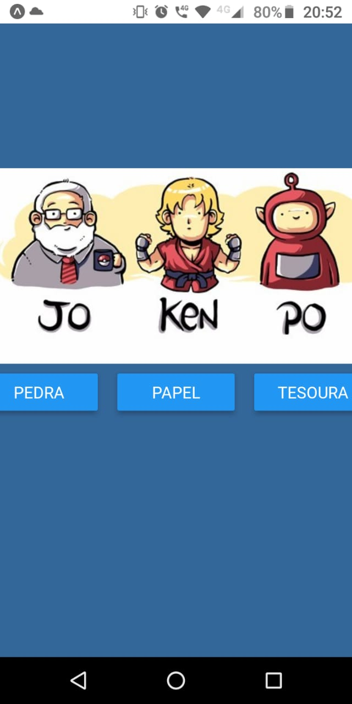
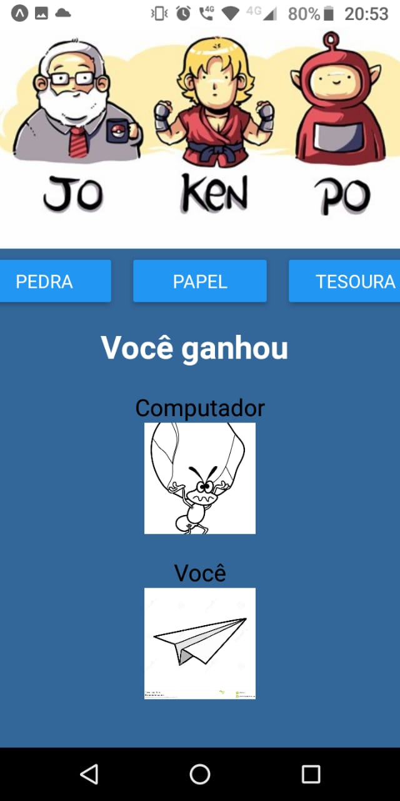
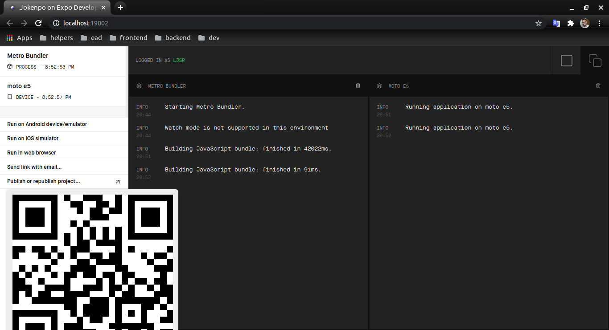
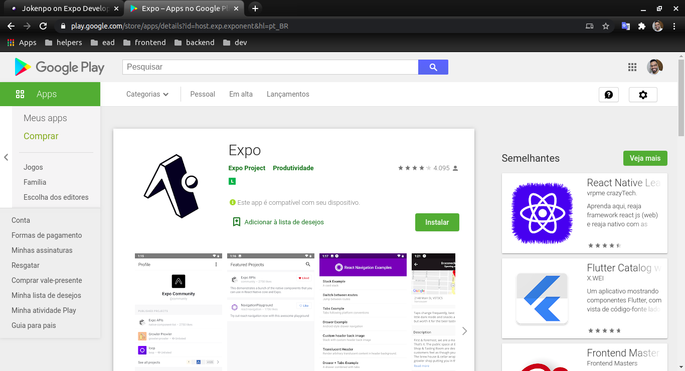

<h1 align="center">
     <a href="#" alt="">Joken-po</a>
</h1>

<h4 align="center">
	🚧   Concluído 🚀 🚧
</h4>

Tabela de conteúdos
<!--ts-->
   * [Sobre o projeto](#-sobre-o-projeto)
   * [Funcionalidades](#-funcionalidades)
   * [Layout](#-layout)
   * [Como executar o projeto](#-como-executar-o-projeto)
     * [Pré-requisitos](#pré-requisitos)
     * [Rodando o Projeto](#user-content--rodando-o-projeto)
   * [Tecnologias](#-tecnologias)
<!--te-->

## 💻 Sobre o projeto

Pedra, papel e tesoura, também chamado no Brasil de joken po é um jogo simples para duas ou mais pessoas, no caso computador 

---

## ⚙️ Funcionalidades

- [x] Feito em react-native com expo para testa e compara seu desepenho quanto react-native puro 

---

## 🎨 Layout

O layout da aplicação 

  
</p>

  
</p>

  
</p>

  
</p>


---

## 🚀 Como executar o projeto
### Pré-requisitos

Antes de começar, você vai precisar ter instalado em sua máquina as seguintes ferramentas:
[Git](https://git-scm.com), [React-native](https://reactnative.dev//),[Expo](https://expo.io/)

Além disto é bom ter um editor para trabalhar com o código como [VSCode](https://code.visualstudio.com/) e também um navegador/Browser de sua escolha eu escolhi [Chorme](https://www.google.pt/intl/pt-PT/chrome/?brand=CHBD&gclid=CjwKCAjw1ej5BRBhEiwAfHyh1CqpdiJkRowiF7qVChVWvkTImra14_fVqzdcxXeYoznuxbgYMmtS9BoCP4oQAvD_BwE&gclsrc=aw.ds)

#### 🎲 Rodando o Projeto

```bash
# Clone este repositório
$ git clone git@github.com:leandrojsantos/react-native.git

# Acesse a pasta do projeto no terminal/cmd
$ cd react-native/jokenpon

# dentro da pasta jokenpon que e a raiz do projeto
$ expo

# para start o projeto
$ expo start
```
Após isso servidor da expo inciará na porta:19002

  
</p>

Instalar/cadastro o [Expo app](https://play.google.com/store/apps/details?id=host.exp.exponent&hl=pt_BR)  no seu  dispositivo android

  
</p>

Feito isso é abrir usando dispositivo android, aplicativo e ler o qr-code

---

## 🛠 Tecnologias

As seguintes ferramentas foram usadas na construção do projeto:

**Server**  
* [Git](https://git-scm.com) 
* [VSCode](https://code.visualstudio.com/)
* [Chorme](https://www.google.pt/intl/pt-PT/chrome/?brand=CHBD&gclid=CjwKCAjw1ej5BRBhEiwAfHyh1CqpdiJkRowiF7qVChVWvkTImra14_fVqzdcxXeYoznuxbgYMmtS9BoCP4oQAvD_BwE&gclsrc=aw.ds)
* [React-native](https://reactnative.dev//)
* [Expo](https://expo.io/)
* [Expo app](https://play.google.com/store/apps/details?id=host.exp.exponent&hl=pt_BR)
